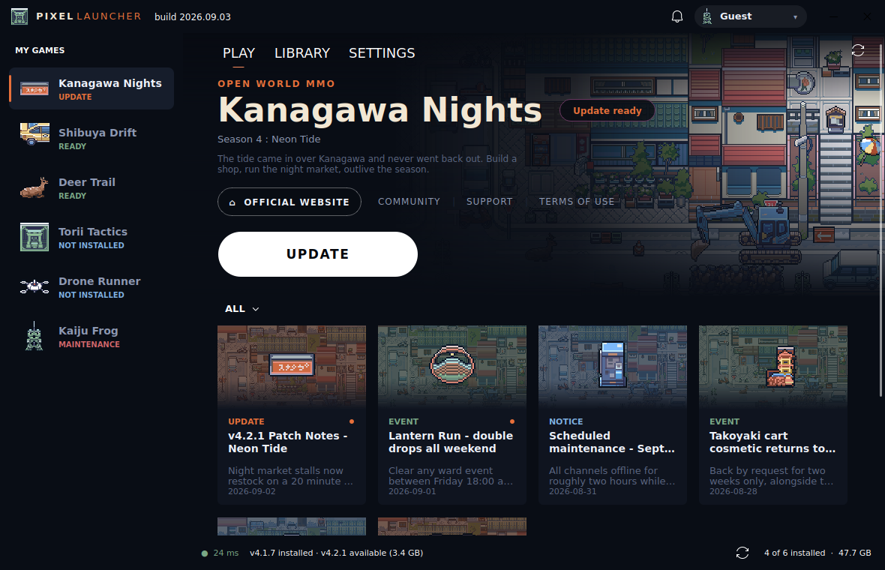
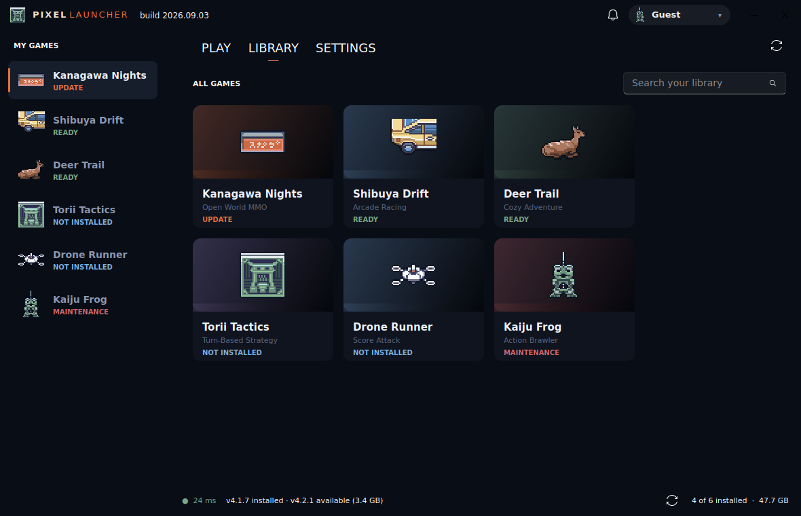
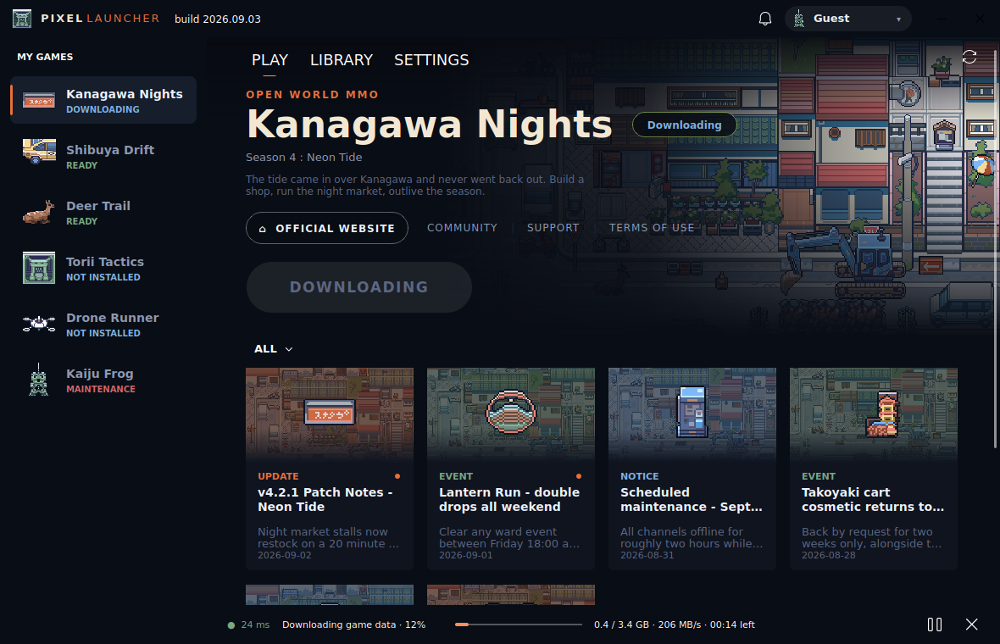
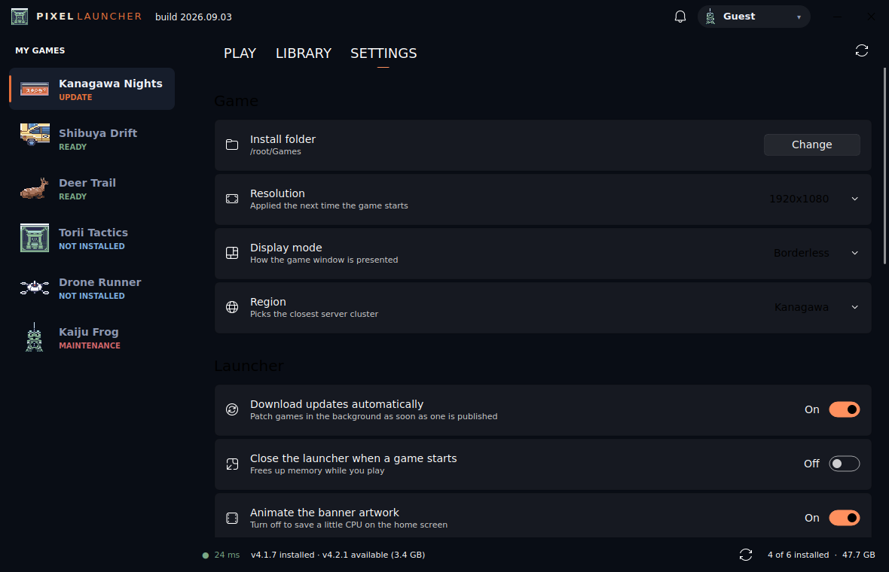

# Pixel Launcher

A Nexon/MapleStory-style game launcher built with **PyQt5** and
**[PyQt-Fluent-Widgets](https://pyqt-fluent-widgets.readthedocs.io/en/latest/)**,
skinned with GuttyKreum's *Urban Accessories* pixel art.

Laid out like a publisher's game page: near-black chrome, full-bleed key art
with the nav floating over it, one white pill call-to-action, and a grid of
notice cards underneath.



## What it does

- **Animated pixel hero** - the artwork GIFs are drawn with nearest-neighbour
  scaling, so they stay crisp instead of turning to mush. A layered scrim
  fades the art into the page, keeping the wordmark, nav and button legible
  over any frame. Each game crops the shared art at a different height, so
  every hero looks distinct.
- **One white pill that knows what it means** - DOWNLOAD, UPDATE or START
  GAME, disabled with a reason during a download, a session or maintenance.
- **Game rail** with live install state: ready / update / not installed /
  downloading / maintenance.
- **Notice grid** of image-topped cards. Each card composes a darkened slice
  of the banner with a subject sprite chosen by category, so a row of four
  reads as four different posts rather than four crops of one street.
- **Working patcher** with staged progress, live speed and ETA, pause,
  resume and cancel. It honours the bandwidth limit from settings.
- **Status strip** along the bottom: best server ping (click for the full
  server list with load meters), version state, download readout, and how
  much of the library is on disk.
- **Library grid** with search.
- **Settings** built from Fluent setting cards: install folder, resolution,
  display mode, region, auto-update, tray behaviour, bandwidth cap, theme
  and accent colour.
- Frameless window, custom title bar, account menu, login dialog and a
  system tray icon.

| Library | Downloading | Settings |
| --- | --- | --- |
|  |  |  |

## Running it

```bash
pip install -r requirements.txt
python main.py
```

Python 3.8+ and a desktop session are required. On a headless box you can
still boot it with `QT_QPA_PLATFORM=offscreen`.

## Tests

```bash
python -m unittest discover -s tests
```

The suite builds the real window offscreen and drives the install → launch
→ exit cycle, so it catches wiring breaks in the state machine.

## Layout

```
main.py                 entry point
launcher/
  core/
    catalog.py          Game model, news feed, install state
    config.py           persisted settings (QConfig)
    patcher.py          simulated downloader: progress, speed, ETA
    pixel.py            nearest-neighbour scaling and crisp text shadows
    paths.py            asset locations
    theme.py            palette taken from the tileset
  ui/
    main_window.py      window, floating nav, the play-button state machine
    home_page.py        hero + category filter + notice grid
    library_page.py     searchable card grid
    settings_page.py    Fluent setting cards
    dialogs.py          sign-in and article dialogs
    style.py            chrome stylesheet
    widgets/
      hero.py           key art, wordmark, nav links, primary action
      news_grid.py      notice cards and their composed thumbnails
      status_bar.py     bottom strip and the server flyout
      game_rail.py      left-hand game selector
      play_button.py    the white pill
      title_bar.py      frameless title bar and account chip
      side_panel.py     server rows used by the flyout
assets/                 pixel art (banners, tiles)
data/                   games.json, news.json, servers.json
tests/
```

## Wiring it to a real game

Two seams are deliberately fake, and both are small:

- `launcher/core/patcher.py` simulates the download. It already emits the
  signals a real client needs (`progress`, `stats`, `stage`, `finished`,
  `cancelled`) - replace `_duration_for` and `_tick` with actual byte
  counts and nothing else has to change.
- `MainWindow._launch()` fakes the game process with a timer. Swap it for a
  `QProcess` and connect `finished` to `_on_game_exit`.

The palette lives in one place, `launcher/core/theme.py`; the chrome
stylesheet in `launcher/ui/style.py` reads from it.

Settings are stored in `~/.pixel-launcher/`. Point `PIXEL_LAUNCHER_HOME`
somewhere else for a portable install.

## Credits

Artwork is the **Urban Accessories v2** pack by
**[GuttyKreum](https://gutty-kreum.itch.io/)**. The pack's original credits
file ships alongside it at `assets/GuttyKreum_Readme.txt`. Check the pack's
own licence before shipping anything built on it.

Widgets come from [PyQt-Fluent-Widgets](https://github.com/zhiyiYo/PyQt-Fluent-Widgets)
by zhiyiYo.
